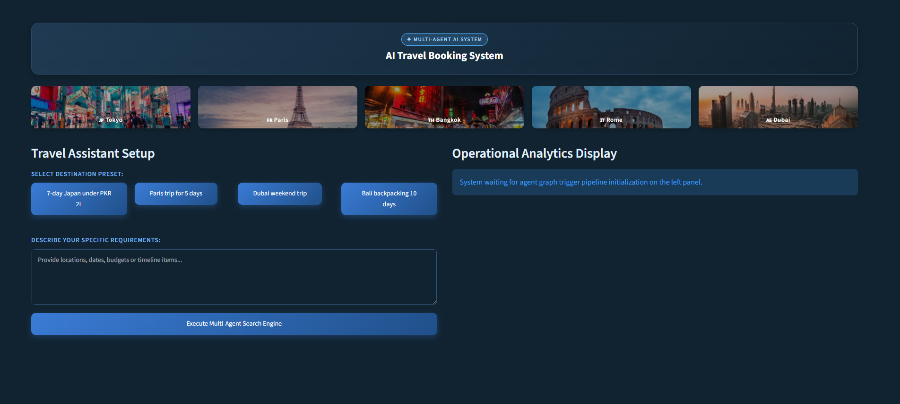
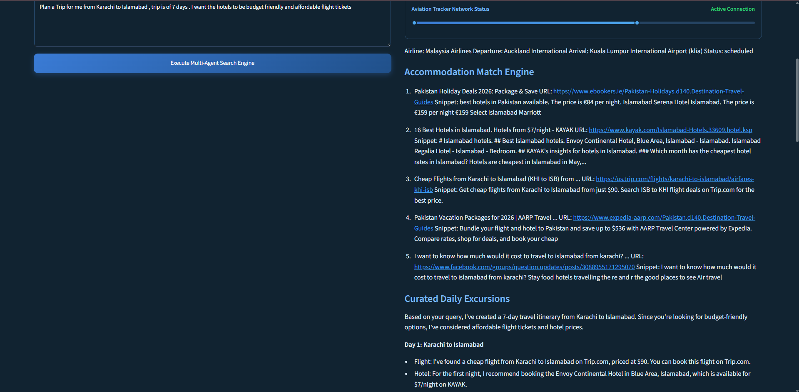
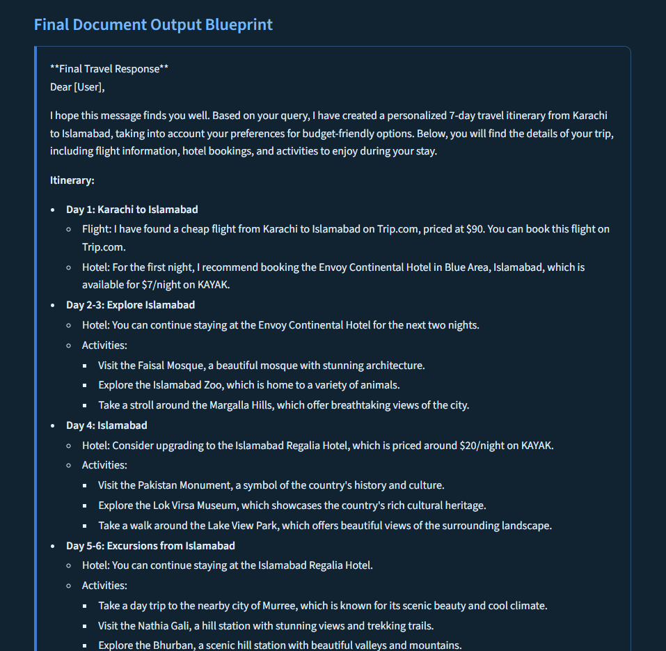

# ✈️ AI Travel Planner (Agentic AI)

An **LLM-powered Multi-Agent AI Travel Planner** built using **LangGraph**, **LangChain**, and **PostgreSQL** that generates personalized travel plans based on user preferences. The system leverages specialized AI agents to collaboratively search for flights, hotels, attractions, budgets and destination insights using real-time APIs.

---

## 🚀 Features

- 🤖 Multi-Agent architecture using **LangGraph**
- ✈️ Real-time flight search using **AviationStack API**
- 🔎 Live web search using **Tavily Search API**
- 🏨 Hotel and attraction recommendations
- 💰 Budget-aware travel planning
- 🗺️ Personalized day-by-day travel itineraries
- 🧠 LLM-powered reasoning with **Groq**
- 🗄️ PostgreSQL-backed state management
- ⚡ Parallel agent execution for faster planning

---

## 🛠️ Tech Stack

- Python
- LangGraph
- LangChain
- Groq LLM
- PostgreSQL
- AviationStack API
- Tavily Search API
- Streamlit

---

# 📂 Project Structure

```
AI_TRAVEL_AGENT/
│── images/
│── travel_plans/
│── tools/
│── frontend.py
│── main.py
│── UI.py
│── README.md
│── .env
```

---

# ⚙️ Installation

## 1. Clone the Repository

```bash
git clone https://github.com/sufyansidd19/AI-Travel-Planner-Agentic-AI.git

cd AI-Travel-Planner-Agentic-AI
```

---

## 2. Create Virtual Environment

### Windows

```bash
python -m venv venv

venv\Scripts\activate
```

### Linux / macOS

```bash
python3 -m venv venv

source venv/bin/activate
```

---

## 3. Install Dependencies

```bash
pip install -r requirements.txt
```

---

# 🔑 API Keys

Create a **`.env`** file in the project root and add the following:

```env
GROQ_API_KEY=your_groq_api_key
TAVILY_API_KEY=your_tavily_api_key
AVIATIONSTACK_API_KEY=your_aviationstack_api_key
```

---

# 📌 How to Get API Keys

## 1️⃣ Groq API Key

1. Visit **https://console.groq.com/keys**
2. Sign in with your account.
3. Click **Create API Key**.
4. Copy the generated key.
5. Paste it into your `.env` file.

Example:

```env
GROQ_API_KEY=gsk_xxxxxxxxxxxxxxxxxxxxxxxxx
```

---

## 2️⃣ Tavily API Key

1. Visit **https://app.tavily.com/**
2. Create an account or log in.
3. Open the Dashboard.
4. Generate an API Key.
5. Copy the key into your `.env`.

Example:

```env
TAVILY_API_KEY=tvly-xxxxxxxxxxxxxxxx
```

---

## 3️⃣ AviationStack API Key

1. Visit **https://aviationstack.com/**
2. Create a free account.
3. Navigate to your Dashboard.
4. Copy your API Access Key.
5. Add it to your `.env` file.

Example:

```env
AVIATIONSTACK_API_KEY=xxxxxxxxxxxxxxxxxxxx
```

---

# ▶️ Run the Application

```bash
python main.py
```

or if using the UI

```bash
streamlit run UI.py
```

---

# 📸 Application Screenshots

## Home Page



---

## Travel Planning



---

## Generated Travel Plan



---

# 🤝 Contributing

Contributions are welcome!

1. Fork the repository
2. Create a new feature branch

```bash
git checkout -b feature-name
```

3. Commit your changes

```bash
git commit -m "Add new feature"
```

4. Push the branch

```bash
git push origin feature-name
```

5. Open a Pull Request

---

# 📄 License

This project is licensed under the **MIT License**.

---

## 👨‍💻 Author

**Sufyan Siddiqui**

If you found this project helpful, consider giving it a ⭐ on GitHub!
